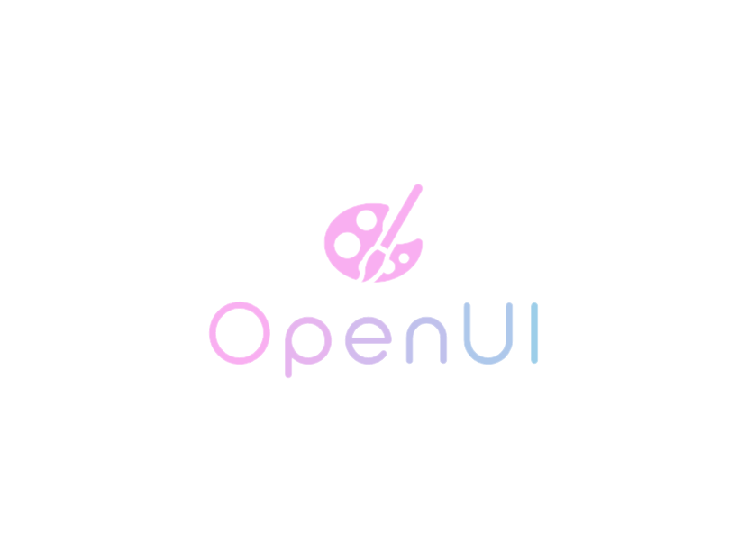
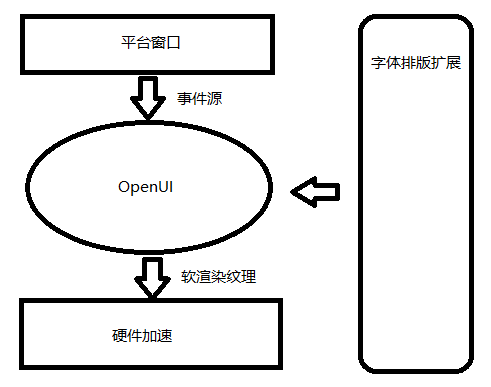
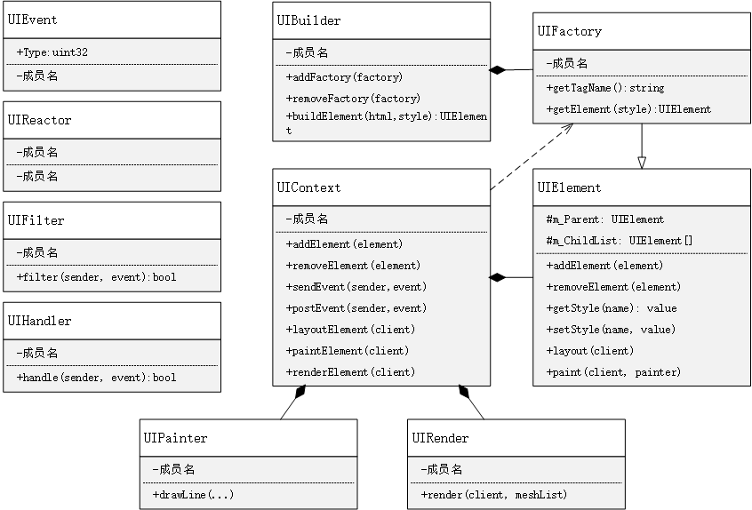

# 设计主旨

## To be more opened, more abstract, more tolerant, more powerful.

  

# 整体设计

  

# 详细设计

  

## 需求列表
* 支持单窗口的控件树机制
* 支持单窗口之间的拖拽事件
* 支持控件的样式+行为定制
* 支持常用的控件+布局# 设计主旨

## To be more opened, more abstract, more tolerant, more powerful.

  

# 整体设计

  

# 详细设计

  

## 需求列表
* 支持单窗口的控件树机制
* 支持单窗口之间的拖拽事件
* 支持控件的样式+行为定制
* 支持常用的控件+布局
* 支持三维场景控件能力
* 支持跨平台的事件处理
* 支持跨平台的渲染后端
* 支持控件动画能力
* 支持动态字体特效

## 开发工作
* 顶层接口设计
* 控件布局计算
* 字体布局排版
* 外部事件处理
* 三维控件框架
* 精灵渲染后端

* 支持三维场景控件能力
* 支持跨平台的事件处理
* 支持跨平台的渲染后端
* 支持控件动画能力
* 支持动态字体特效

## 开发工作
* 顶层接口设计
* 控件布局计算
* 字体布局排版
* 外部事件处理
* 三维控件框架
* 精灵渲染后端
