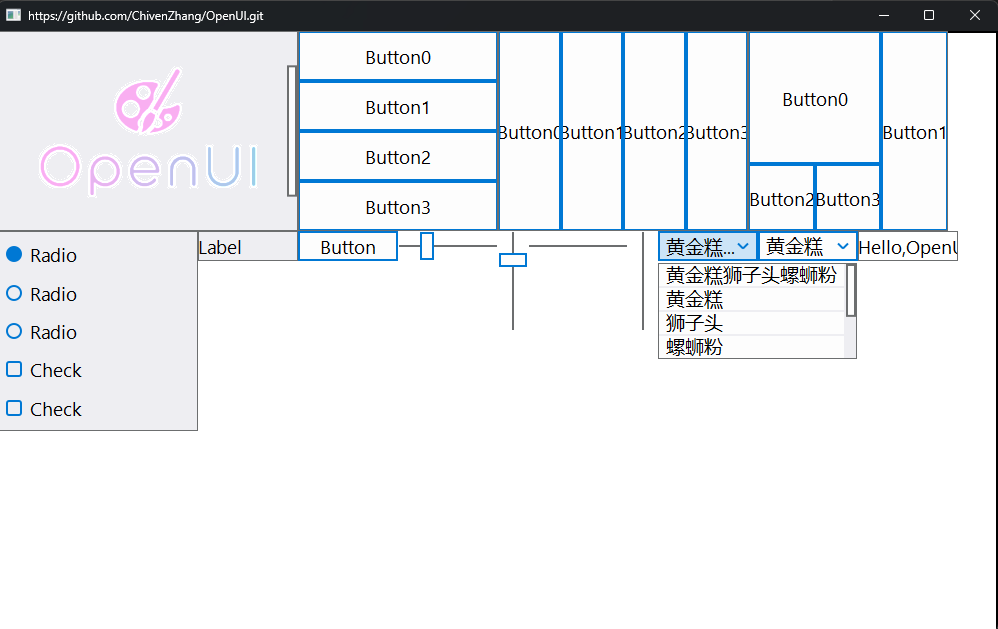

<div align="center">
  
</div>

## Description
A retained mode GUI solution for c++ game development.
```c++
auto vbox = UINew<UIVBox>();
context->addElement(vbox);
vbox->setFixedSize(200, 200);

auto button = UINew<UIButton>();
vbox->addElement(button);
button->setText("button");
...
```

## Features
- [x] 支持单窗口的控件树机制
- [x] 支持控件的样式+行为定制
- [x] 支持常用的控件+布局
- [x] 支持跨平台的事件处理
- [x] 支持跨平台的渲染后端
- [x] 支持控件动画能力
- [ ] 支持跨平台计量单位（rem）
- [ ] 支持动态字体特效
- [ ] 支持三维场景控件能力
- [ ] 支持单窗口之间的拖拽事件

## Works to do
- [x] 顶层接口设计
- [x] 控件布局计算
- [x] 字体布局排版
- [x] 外部事件处理
- [x] OpenGL渲染后端
- [x] Vulkan渲染后端
- [ ] D3D12 渲染后端
- [ ] 三维控件框架

## How to install
* Add "VCPKG_ROOT_CUSTOM" to environment.
* Run [VCPKG](https://learn.microsoft.com/zh-cn/vcpkg/get_started/overview) in the project directory.
* Use [CMAKE](https://cmake.org/getting-started/) to open CMakeLists.txt and build it.
* See "Sample/main.cpp" for more details.

# Presentation

<div align="center">
  
</div>
<p>兴趣讨论QQ群：1006760893</p>
